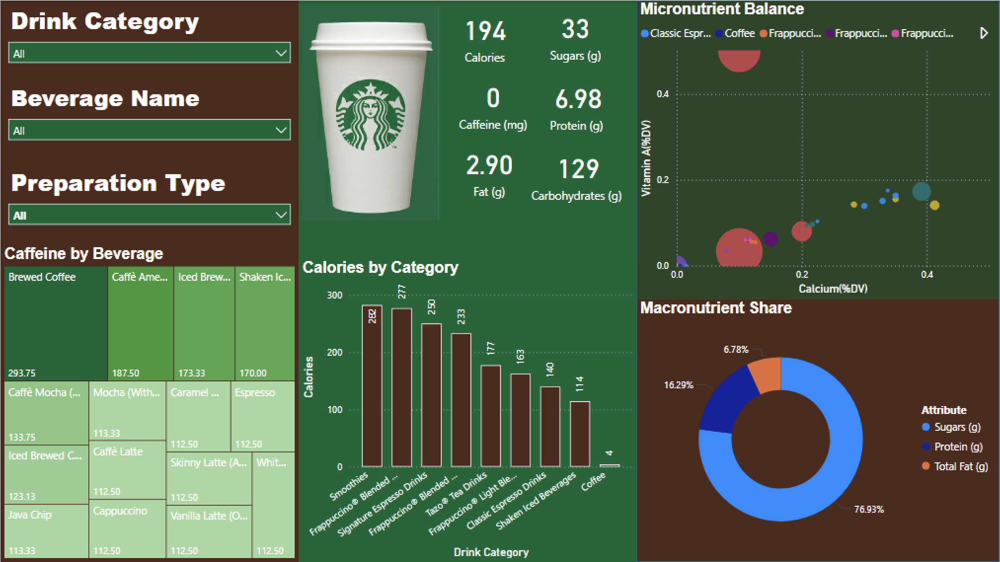
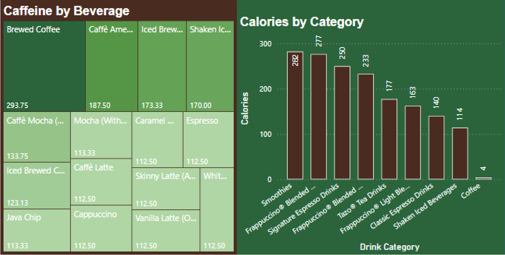
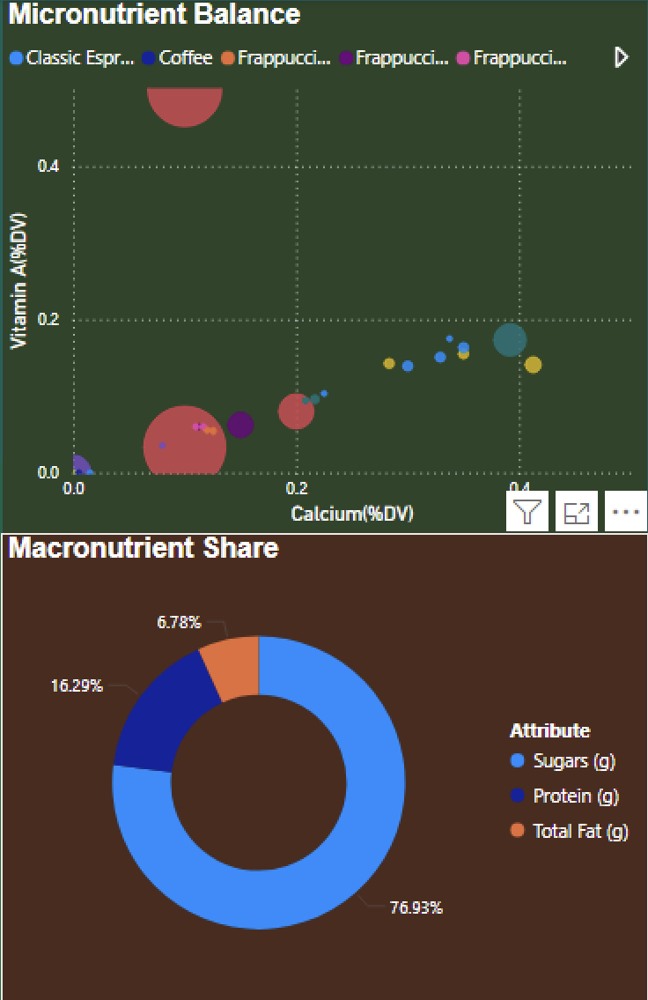

# Starbucks Beverage Nutrition Dashboard | Power BI & Data Visualisation

## Project Overview

This project analyses the nutritional composition of Starbucks beverages using Microsoft Power BI. The dashboard enables users to explore beverage categories, caffeine levels, calorie distribution, sugar content, macronutrients, and micronutrient balance through interactive visualisations and filters.

The objective was to transform raw nutrition data into an intuitive business intelligence solution that supports nutritional comparison and consumer insights.

---

## Key Features

- Interactive Power BI dashboard with dynamic filtering
- Beverage analysis across calories, caffeine, sugars, fats, proteins, and carbohydrates
- Nutrition comparison across drink categories and preparation types
- Micronutrient analysis using Calcium and Vitamin A indicators
- Treemap visualisation for caffeine comparison across beverages
- Category-wise calorie analysis
- Macronutrient composition breakdown
- Data modelling using dimension tables and relationships
- Data transformation and cleaning using Power Query

---

## Tools & Technologies

- Microsoft Power BI
- Power Query
- Data Modelling
- Data Visualisation
- Microsoft Excel
- Business Intelligence
- Data Analytics

---

## Dashboard Screenshots

### Dashboard Overview



### Beverage Comparison



### Nutrition Analysis



---

## Data Preparation

The raw Starbucks beverage nutrition dataset was cleaned and transformed using Power Query.

Key transformations included:

- Handling inconsistent data formats
- Creating dimension tables for improved modelling
- Restructuring nutritional attributes using unpivot operations
- Building relationships between beverage, category, size, milk type, and preparation dimensions
- Optimising the dataset for interactive dashboard filtering

---

## Key Insights

- Brewed Coffee and Americanos contain the highest caffeine levels.
- Smoothies and Frappuccino-based beverages are among the highest-calorie drink categories.
- Sugar contributes the largest proportion of total macronutrients across beverages.
- Significant nutritional differences exist between beverage categories and preparation types.
- Lower-calorie beverages generally provide healthier alternatives compared to dessert-style beverages.

---

## Repository Structure

```text
Starbucks-Nutrition-Dashboard
│
├── dashboard
│   └── Starbucks_Nutrition_Dashboard.pbix
│
├── data
│   └── starbucks.xlsx
│
├── screenshots
│   ├── Dashboard_Overview.png
│   ├── Beverage_Comparison.png
│   └── Nutrition_Analysis.png
│
├── LICENSE
└── README.md
```

## Files Included

### Power BI Dashboard
Interactive dashboard developed using Microsoft Power BI.

### Dataset
Starbucks beverage nutrition dataset used for analysis and visualisation.

### Screenshots
Preview images of dashboard pages and key visualisations.

---

## How to Use

1. Download the repository.
2. Open the `.pbix` file using Microsoft Power BI Desktop.
3. Refresh data if required.
4. Explore the dashboard using available filters and slicers.

---

## Skills Demonstrated

- Data Cleaning
- Data Transformation
- Data Modelling
- Power BI Development
- Power Query
- Dashboard Design
- Business Intelligence
- Data Visualisation
- Insight Generation

---

## Author

**Saurabh Kumar**

Master of Business (Data Analytics for Business)  
Monash University

GitHub: https://github.com/sk8r21